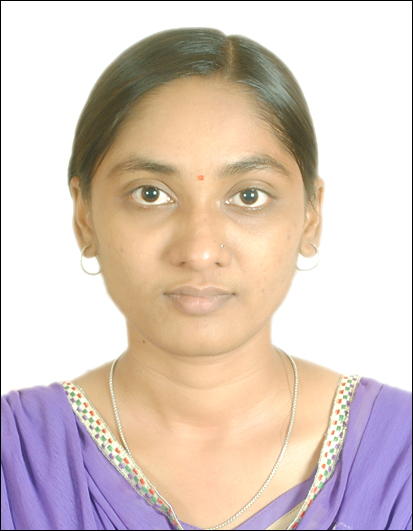

<html>
<head>
<title>Kamini Sabu</title> <!-- title you see on the top title bar of browser tab -->
<link rel="stylesheet" type="text/css" href="mytabs.css">
</head>
<body>

</body>
<!-- Tab links -->

  <button class="tablinks" onclick="openCity(event, 'London')" id="defaultOpen">About</button>
  <button class="tablinks" onclick="openCity(event, 'Paris')">Academics</button>
  <button class="tablinks" onclick="openCity(event, 'Tokyo')">Publications</button>
  <button class="tablinks" onclick="openCity(event, 'Mumbai')">Others</button>

<!-- Tab content -->

  <h3>About</h3>

 Kamini is lead engineer in ASR preprocessing team at Samsung Research Institute Bangalore. She holds PhD in Electronic Systems (Dept. of Electrical Engg.) from the Indian Institute of Technology Bombay, Mumbai, India. She was part of the LETS project for assessing children's speech with Prof. Preeti Rao. Her research publications can be found in publications tab.

 Her main area of research interests include Speech Prosody, Speech Preprocessing, Speech Recognition, Speech Synthesis, Machine Learning, Natural Language Processing and Image Processing.

 She can be contacted at <a href="mailto:kaminimsabu@gmail.com">kaminimsabu@gmail.com</a>

  <h3>Academics</h3>

<h3>Educational Qualifications</h3>

<table>
<col width="400px" />
<col width="400px" />
<col width="400px" />
<col width="100px" />
<col width="100px" />
<tr><th> Examination </th><th> University </th><th> Institute </th><th> Year </th><th> CPI/% </th></tr>
<tr><td> PhD (Electronic Systems) </td><td> IIT Bombay </td><td> IIT Bombay </td><td style="text-align:center"> 2022 </td><td style="text-align:center"> 9.12 </td></tr>
<tr><td> M.E. (Digital Systems) </td><td> North Maharashtra University </td><td>Govt. College of Engg., Jalgaon</td><td style="text-align:center"> 2015 </td><td style="text-align:center"> 68.05 </td></tr>
<tr><td> B.E. (Elect. & Telecom. Engg.) </td><td> North Maharashtra University </td><td>Govt. College of Engg., Jalgaon</td><td style="text-align:center"> 2013 </td><td style="text-align:center"> 71.07 </td></tr>
</table>

<h3>Other Achievements</h3>
<ol>
<li> Successfully completed the course "Engineering in Speech Science: Behavioral Machine Intelligence and Applications" conducted by IIT Madras under Scheme of Promotion and Academic Research Collaboration (SPARC), MHRD, Govt of India.</li>
<li> Attended I-NCUBATE program 2019 conducted The Gopalakrishnan Deshpande Center for Innovation & Entrepreneurship (GDC), IIT Madras and dedicated to consumer survey for the PhD project.</li>
<li> Selected among top 20 presenters for The Third Evaluation and Presentation Workshop of Visvesvaraya PhD Fellows 2017.</li>
<li> Selected for PhD under prestigious Visvesvaraya PhD scheme.</li>
<li> Achieved 99.14 percentile in GATE (EC) 2013 among 256135 candidates.</li>
<li> Completed online course taught by Andrew Ng on Coursera.</li>
</ol> 

  <h3>Publications</h3>

<b> Publications from PhD project</b>
<ul>
<li> K. Sabu and P. Rao, "Prosodic event detection in children’s read speech", (submitted for reveiew) Computer Speech and Language, 2020.</li>
<li> K. Sabu and P. Rao, "Automatic prediction of confidence level from children’s oral reading recordings", Proc. of Interspeech, Oct 2020, Shanghai, China.</li>
<li> K. Sabu, S. Chaudhuri, P. Rao, and M. Patil, "An Optimized Signal Processing Pipeline for Syllable Detection and Speech Rate Estimation", Proc. of NCC, Feb 2020, Kharagpur, India.</li>
<li> P. Rao, K. Sabu, N. Nayak, and B. Shreeharsha, "System for automatic assessment of fluency in spoken language and a method thereof", 2019, (submitted vide) Indian Patent Application Number: 201921041761.</li>
<li> K. Sabu, K. Kumar and P. Rao, "Automatic Detection of Expressiveness in Oral Reading", Special session: Show And Tell, Interspeech, Sep 2018, Hyderabad, India.</li>
<li> K. Sabu and P. Rao "Automatic Assessment of Children’s Oral Reading using Speech Recognition and Prosody Modeling", CSI Transactions on ICT, S.I. Visvesvaraya, pp 1-5, Jun 2018, Springer.</li>
<li> K. Sabu and P. Rao, "Detection of Prominent Words in Oral Reading by Children", Proc. of Speech Prosody, Jun 2018, Poznan, Poland.</li>
<li> K. Sabu, K. Kumar, and P. Rao, "Improving the Noise Robustness of Prominence Detection for Children’s Oral Reading Assessment", Proc. of NCC, Feb 2018, Hyderabad, India.</li>
<li> K. Sabu, P. Swarup, H. Tulsiani and P. Rao, "Automatic Assessment of Children’s L2 Reading for Accuracy and Fluency", Proc. of SLaTE, Aug 2017, Stockholm, Sweden.</li>
<li> A. Pasad, K. Sabu and P. Rao, "Voice Activity Detection for Children’s Read Speech Recognition in Noisy Conditions", Proc. of NCC, Mar 2017, IIT Madras, India.</li>
</ul>
<b> Publications from MTech Project</b>
<ul>
<li> K. Sabu and M. H. Nerkar, "Vanishing Point Estimation for On-Road Navigation", International Journal of Emerging Technology and Advanced Engineering, 5(4), 73-77, 2015.</li>
<li>K. Sabu and M. H. Nerkar, "Colour Vision Based Drivable Road Area Estimation", International Journal of Innovative Research and Development, 4(5), 234-237, 2015.</li>
</ul>
<b> Other publications from PhD</b>
<ul>
<li> P. Rao, M. Pandya, K. Sabu, K. Kumar and N. Bondale, "A Study of Lexical and Prosodic Cues to Segmentation in a Hindi-English Code-switched Discourse", Proc. of Interspeech, Sep 2018, Hyderabad,
India.</li>
<li> P. Rao, N. Sanghvi, H. Mixdorff and K. Sabu, "Acoustic Correlates of Focus in Marathi: Production and Perception", Journal of Phonetics 65, Nov 2017, pp. 110-125.</li>
<li> S. Barhate, S. Kshirsagar, N. Sanghvi, K. Sabu, P. Rao and N. Bondale, "Prosodic Features of Marathi News Reading Style", Proc. of IEEE TENCON, Nov 2016, Singapore.</li>
</ul>

  <h3>Others</h3>

Some really interesting websites:
 
For any help regarding web and coding, you can visit <a href="https://github.com/wncc/learners-space/blob/master/Web%20Development/Week%202/CSS.md">WnCC github</a>
 
<a href="https://docs.github.com/en/free-pro-team@latest/github/working-with-github-pages/creating-a-github-pages-site">Github</a> also provides facility to make a webpage.
 
This same website is also accessible from github at <a href="https://kaminisabu.github.io/">https://kaminisabu.github.io/</a>
 
In order to change the content of website, I need to go to <a href="https://bighome.iitb.ac.in/index.php/apps/files/?dir=/public_html&fileid=6936483">https://bighome.iitb.ac.in/index.php/apps/files/?dir=/public_html&fileid=6936483</a> and <a href="https://github.com/KaminiSabu/kaminisabu.github.io/edit/main/index.md">https://github.com/KaminiSabu/kaminisabu.github.io/edit/main/index.md</a>
 

Python Packages for Data Science:
 
  <ol>
    <li> Data manipulation <\li>
      <ul>
        <li> Numpy </li>
        <li> Scipy </li>
        <li> Pandas </li>
      </ul>
    <li> Visualization <\li>
      <ul>
        <li> Matplotlib </li>
        <li> Seaborn </li>
        <li> Plotly </li>
      </ul>
    <li> Machine learning <\li>
      <ul>
        <li> Scikit-learn </li>
        <li> Tensorflow </li>
        <li> Keras </li>
      </ul>
    <li> Data scraping <\li>
      <ul>
        <li> Scrapy </li>
    <li> NLP <\li>
      <ul>
        <li> NLTK </li>
        <li> Gensim </li>
      </ul>
    <li> Statistics </li>
      <ul>
        <li> Statsmodels </li>
      </ul>
  </ol>

